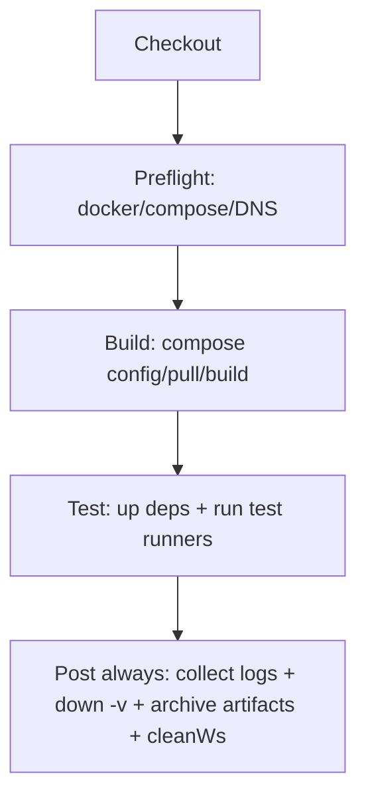
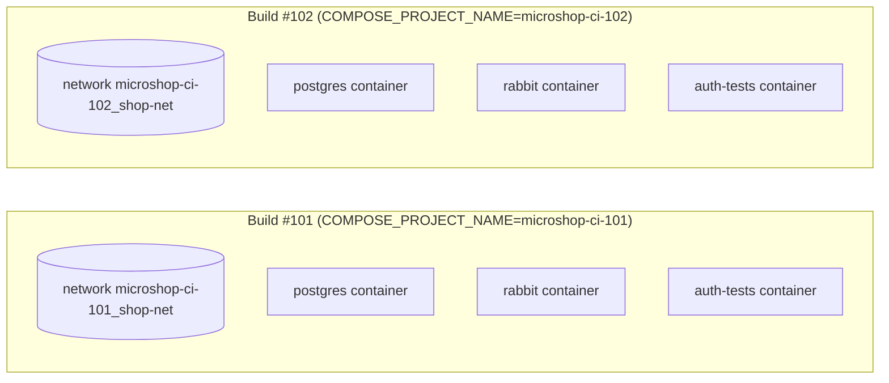

# Microservice CI/CD Notes (Testing + Jenkins + Debug Checklist)

Date: 2026-03-03 (Asia/Bangkok)

---

## 0) TL;DR

- `pytest` **không tự động = unit test**. Nó chỉ là test runner.
- Với fixture bạn đưa (`sqlite+pysqlite:///:memory:` + override dependencies), test của `payment-service` là **service-level integration (in-process)**:
  - **không cần Postgres/Rabbit thật**
  - chạy được bằng `pytest -q` (không Docker)
- Nếu service nào **thực sự** cần Postgres/Rabbit/Mailhog thì mới dùng Docker Compose trong CI.

---

## 1) Test Taxonomy (dùng để quyết định CI chạy gì)

| Layer | Mục tiêu | Có DB thật? | Có network thật? | Chạy ở đâu |
|---|---|---:|---:|---|
| Unit | test function/class | ❌ | ❌ | local + CI |
| Service-level integration (in-process) | test FastAPI + ORM + dependencies override | ✅ (SQLite memory) / ❌(Postgres) | ❌ (mock http) | local + CI |
| Infra integration | test service + Postgres/Rabbit thật | ✅ | ✅ (docker net) | CI |
| E2E | test luồng nhiều service | ✅ | ✅ | CI (hoặc staging) |

---

## 2) Payment-service: vì sao không cần Postgres/Rabbit trong CI?

### 2.1 SQLite in-memory Engine
Bạn dùng:

```python
create_engine(
  "sqlite+pysqlite:///:memory:",
  connect_args={"check_same_thread": False},
  poolclass=StaticPool,
)
```

Điểm chính:
- `:memory:` → DB nằm trong RAM, tự reset theo test process
- `StaticPool` + `check_same_thread=False` → đảm bảo reuse connection cho FastAPI TestClient

### 2.2 Override DB binding & FastAPI dependency
Bạn override `engine`, `SessionLocal`, và `get_db`:

```python
monkeypatch.setattr(dbmod, "engine", test_engine, raising=True)
monkeypatch.setattr(dbmod, "SessionLocal", TestingSessionLocal, raising=True)
main.app.dependency_overrides[main.get_db] = override_get_db
```

=> App trong test **không chạm Postgres**.

### 2.3 Mock HTTP (`httpx.AsyncClient`) bằng fake client
Bạn thay `httpx.AsyncClient` để tránh call thật sang `ORDER_URL_INTERNAL`.

=> Test không cần service `order` chạy thật.

---

## 3) Khi nào bạn cần Docker Compose trong CI?

Bạn cần compose khi:
- test thật sự connect `postgresql+psycopg://...@postgres:5432/...`
- test publish/consume Rabbit thật
- test gọi HTTP thật sang service khác (order/product/payment...)
- bạn muốn E2E

Nếu không có các điều kiện này → chạy `pytest` trực tiếp sẽ nhanh hơn và ít lỗi hơn.

---

## 4) Jenkinsfile hiện tại: giải thích theo flow

### 4.1 Flow diagram (high level)



### 4.2 Preflight stage làm gì?
- In thông tin môi trường
- Check docker & compose
- Check DNS `api.github.com` để bắt lỗi `UnknownHostException` sớm

### 4.3 Build stage làm gì?
- `$C config` render + validate compose merged (base + ci)
- `$C pull` (best effort)
- `$C build --pull` build images

### 4.4 Test stage làm gì?
- Up shared services: `postgres rabbit mailhog`
- Chạy từng test runner: `docker compose run --rm <svc-tests>`
- Nếu fail: dump `compose ps`, `compose logs --tail`, và `docker logs`

### 4.5 Post always làm gì?
- Thu thập artifacts (ps/logs/config)
- Cleanup: `$C down -v --remove-orphans`
- Archive artifacts + clean workspace

---

## 5) Diagram: Docker Compose namespace theo BUILD_NUMBER



=> Mỗi build có network/containers riêng, giảm đụng nhau.

---

## 6) Tối ưu CI: 2 chế độ chạy (Fast vs Integration)

### 6.1 Mode A — FAST (không Docker)
Dùng cho service có fixture SQLite memory + mock http (như payment-service bạn gửi).

Jenkins stage mẫu:

```groovy
stage('Test (fast)') {
  steps {
    sh '''#!/usr/bin/env bash
      set -euxo pipefail
      python -V
      pytest -q
    '''
  }
}
```

### 6.2 Mode B — INTEGRATION (có Docker Compose)
Dùng khi test cần Postgres/Rabbit/Mailhog thật.

Ý tưởng:
- up deps
- (nếu test hit http thật) up thêm runtime services cần thiết
- run pytest hoặc run test runners

---

## 7) Jenkinsfile mẫu “chuẩn” (Fast + Integration + Build)

> Mẫu dưới đây giữ nguyên phong cách pipeline bạn đang dùng, chỉ chia test ra 2 tầng.

```groovy
pipeline {
  agent any

  options {
    timestamps()
    ansiColor('xterm')
    disableConcurrentBuilds()
  }

  environment {
    DOCKER_BUILDKIT = "1"
    COMPOSE_DOCKER_CLI_BUILD = "1"
    COMPOSE_PROJECT_NAME = "microshop-ci-${env.BUILD_NUMBER}"
  }

  stages {
    stage('Checkout') {
      steps { checkout scm }
    }

    stage('Preflight') {
      steps {
        sh '''#!/usr/bin/env bash
          set -euo pipefail
          echo "== Docker =="
          docker version
          echo "== Compose =="
          if docker compose version >/dev/null 2>&1; then
            docker compose version
          elif docker-compose version >/dev/null 2>&1; then
            docker-compose version
          else
            echo "ERROR: docker compose not found"
            exit 1
          fi
          echo "== DNS sanity =="
          getent hosts api.github.com || true
        '''
      }
    }

    stage('Test (fast, no docker)') {
      steps {
        sh '''#!/usr/bin/env bash
          set -euxo pipefail
          # ví dụ: chỉ chạy test fast cho payment-service
          # tùy repo bạn có thể cd vào services/payment-service hoặc dùng -k/-m
          pytest -q
        '''
      }
    }

    stage('Build images (compose)') {
      steps {
        sh '''#!/usr/bin/env bash
          set -euxo pipefail
          if docker compose version >/dev/null 2>&1; then
            COMPOSE="docker compose"
          else
            COMPOSE="docker-compose"
          fi
          C="$COMPOSE -p ${COMPOSE_PROJECT_NAME} -f docker-compose.yml -f docker-compose.ci.yml"
          $C config
          $C pull --ignore-pull-failures || true
          $C build --pull
        '''
      }
    }

    stage('Integration tests (compose)') {
      when { expression { return fileExists('docker-compose.ci.yml') } }
      steps {
        sh '''#!/usr/bin/env bash
          set -euxo pipefail
          if docker compose version >/dev/null 2>&1; then
            COMPOSE="docker compose"
          else
            COMPOSE="docker-compose"
          fi
          C="$COMPOSE -p ${COMPOSE_PROJECT_NAME} -f docker-compose.yml -f docker-compose.ci.yml"

          # up deps
          $C up -d postgres rabbit mailhog
          $C up -d --wait postgres rabbit mailhog || true

          # nếu integration test có gọi HTTP thật, hãy up runtime services tương ứng:
          # $C up -d product order payment notify auth
          # $C up -d --wait product order payment notify auth || true

          # chạy test runner containers (nếu bạn dùng pattern *-tests)
          $C run --rm auth-tests
          $C run --rm product-tests
          $C run --rm order-tests
          $C run --rm payment-tests
          $C run --rm notify-tests
        '''
      }
    }
  }

  post {
    always {
      sh '''#!/usr/bin/env bash
        set +e
        if docker compose version >/dev/null 2>&1; then
          COMPOSE="docker compose"
        else
          COMPOSE="docker-compose"
        fi
        C="$COMPOSE -p ${COMPOSE_PROJECT_NAME} -f docker-compose.yml -f docker-compose.ci.yml"
        mkdir -p ci-artifacts
        $C ps > ci-artifacts/compose-ps.txt 2>&1 || true
        $C logs --no-color > ci-artifacts/compose-logs.txt 2>&1 || true
        $C config > ci-artifacts/compose-config.rendered.yml 2>&1 || true
        docker ps -a > ci-artifacts/docker-ps-a.txt 2>&1 || true
        docker network ls > ci-artifacts/docker-networks.txt 2>&1 || true
        $C down -v --remove-orphans || true
      '''
      archiveArtifacts artifacts: 'ci-artifacts/*', allowEmptyArchive: true
      cleanWs()
    }
  }
}
```

---

## 8) Docker Compose CI file: points cần chú ý

### 8.1 `depends_on: condition: service_healthy`
- Chỉ hoạt động đúng nếu service đó có `healthcheck` trong compose base.
- Compose v2 xử lý tốt hơn; v1 có giới hạn.

### 8.2 `*_URL_INTERNAL` cần runtime service đang chạy
Nếu test runner gọi thật tới:
- `http://product:8000`
- `http://order:8000`

thì bạn phải `up -d product order ...` trước khi chạy test.

Nếu bạn mock hết HTTP như payment-service → không cần.

---

## 9) Debug checklist khi CI fail

### 9.1 DNS / network
- Preflight: `getent hosts api.github.com`
- Nếu fail: check `/etc/resolv.conf`, `systemd-resolved`, Jenkins agent DNS, proxy.

### 9.2 Docker daemon permissions
- Jenkins user có quyền chạy docker?
- `docker ps` có chạy không?

### 9.3 Compose config mismatch
- Xem artifact: `ci-artifacts/compose-config.rendered.yml`
- Xem `ci-artifacts/compose-logs.txt`

### 9.4 Healthcheck không healthy
- `ci-artifacts/compose-ps.txt`
- tail logs postgres/rabbit

### 9.5 Test runner fail
- xem `ci-artifacts/*tests*.out.log` (nếu bạn tee theo service)
- kiểm tra env vars trong compose ci

---

## 10) Next steps (gợi ý triển khai)
- Tag test bằng marker:
  - `@pytest.mark.unit`
  - `@pytest.mark.integration`
- CI chạy:
  - `pytest -q -m "not integration"` cho fast stage
  - `pytest -q -m "integration"` cho compose stage

---
